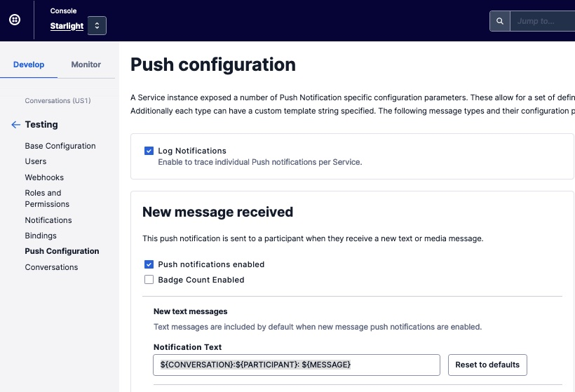
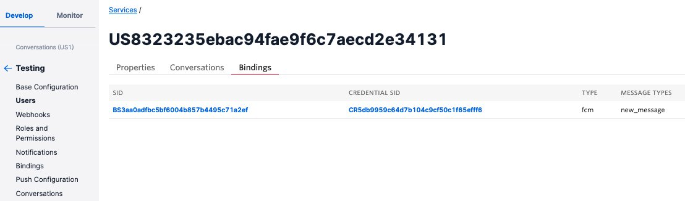
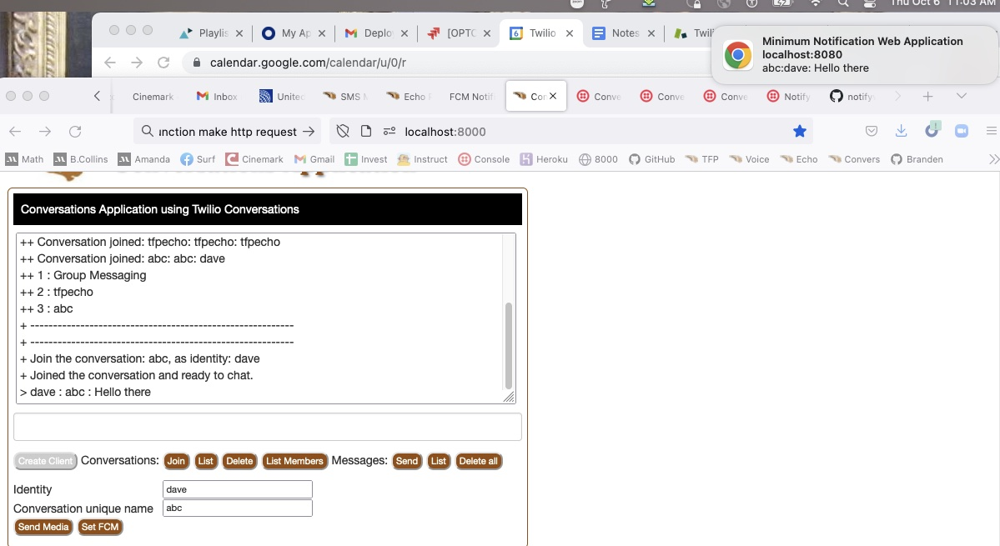

# Twilio Conversations Web Application

This Conversations web application is a developer/training application that is ready to run. 

To do:
+ If no Conversations channel, then don't send a message.
+ One click deploy option in the README.md file.
+ Steps to test, once deployed.

Client Application screen print:


Sample usage sequence:
+ After loading the client in your browser, 
click List conversations to view the conversations in the Twilio Conversations service.
This makes a server side call to list all conversations.
All server side calls(HTTP requests) are handle in: [webserver.js](webserver.js).
+ Enter an identity to use in the creation of your token(server side call).
Click Create Client to create a Conversations client object.
Current joined conversations are listed.
+ Enter a conversation name a click Join.
You will be added into the conversation.
If it's a new conversation it will be created.
You will be added into the conversation, if you are not already in the conversation.
+ Click Messages to get a list of messages currently in the conversation.
+ Enter a text message in the field above the buttons.
Hit the enter key, or click Send, to send the message.
The message will be displayed.
+ Optionally, click Delete to delete the conversation.
Known bug, the conversation stays in the participant's list of joined conversations.
Refresh the page to reuse the same conversation name.
+ Open another browser tab and load the client.
Enter a new identity, enter the same room as the other client, and chat.

### Implementation Requirements:

You will need a Twilio account. A free Trial account will work.
To run locally on your computer install and test Node.JS.

Install the Twilio SDK helper library and Express.
Express for running the Node web servers.
````
$ npm install twilio
$ npm install express
````

To run the application,
+ Set configurations using the Twilio Console,
+ Add environment variables (see following), 
and your ready to run it on your local server that has Node.js installed.

Before running from command line, add the following as environment variables.
Create the variables where required.
+ CONVERSATIONS_ACCOUNT_SID : your Twilio account SID (starts with "AC", available from Twilio Console)
+ CONVERSATIONS_ACCOUNT_AUTH_TOKEN : Your Twilio account auth token
+ CONVERSATIONS_API_KEY : one of your Twilio API keys
+ CONVERSATIONS_API_KEY_SECRET : the matching API key secret string
+ CONVERSATIONS_SERVICE_SID : your Conversations service SID (starts with IS).
+ CONVERSATIONS_MESSAGING_SERVICE_SID : Conversation service Messaging Service SID.
+ PORT : optional, web server port. When running on a local server, default port is 8000.

Download this repository's zip into a working directory and unzip it.

To run:
````
$ node webserver.js 
+++ Conversations application web server is starting up.
+ Listening on port: 8000
...
````
Or using:
````
$ npm start
> tfpconversations@1.2.1 start
> node webserver.js
+++ Conversations application web server is starting up.
+ Listening on port: 8000
...
````

## Files

- [docroot/index.html](docroot/index.html) : Client HTML
- [docroot/conversations.js](docroot/conversations.js) : Client JavaScript
- [docroot/custom/chat.css](docroot/custom/chat.css) : Chat client styles, CSS
- [webserver.js](webserver.js) : a NodeJS Express HTTP Server that serves the client files.
- [app.json](app.json) : Heroku deployment file to describe the application.
- [package.json](package.json) : Heroku deployment file which sets the programming language used.

## Twilio Console Configuration

These are the steps to configure to use the Chat Web Application.
No development or credit card information required to try Chat.

1. Create an API key and secret string:

[https://www.twilio.com/console/project/api-keys](https://www.twilio.com/console/project/api-keys)

2. Create a Conversations Service:

[https://www.twilio.com/console/conversations/services](https://www.twilio.com/console/conversations/services)

Conversations Default configurations:
[https://www.twilio.com/console/conversations/configuration/defaults](https://www.twilio.com/console/conversations/configuration/defaults)

Messaging Services
[https://www.twilio.com/console/sms/services](https://www.twilio.com/console/sms/services)

--------------------------------------------------------------------------------
### Documentation Links

JavaScript links:
+ [Docs](https://media.twiliocdn.com/sdk/js/conversations/releases/1.2.1/docs/)
+ [Client class](https://media.twiliocdn.com/sdk/js/conversations/releases/1.2.1/docs/Client.html)
+ [Conversation class](https://media.twiliocdn.com/sdk/js/conversations/releases/1.2.1/docs/Conversation.html)
+ [Message class](https://media.twiliocdn.com/sdk/js/conversations/releases/1.2.1/docs/Message.html)

Server side API resources:
+ [Service](https://www.twilio.com/docs/conversations/api/service-resource)
+ [Conversation](https://www.twilio.com/docs/conversations/api/conversation-resource)
+ [Conversation Participants](https://www.twilio.com/docs/conversations/api/conversation-participant-resource)
+ [Conversation Messages](https://www.twilio.com/docs/conversations/api/conversation-message-resource)
+ [User](https://www.twilio.com/docs/conversations/api/user-resource)
+ [Message](https://www.twilio.com/docs/conversations/api/service-conversation-message-resource)

Sample applications:
+ [React application](https://www.twilio.com/docs/conversations/javascript/exploring-conversations-javascript-quickstart)
 
--------------------------------------------------------------------------------
### To Do Next

+ Add notifications such as new message added to the conversation.
 + If conversation is deleted, remove it from conversationList[].
+ Get TokenAboutToExpire to work properly. Function: onTokenAboutToExpire
+ List participants in a conversation.
+ List conversations that the participant is in.
+ Modify friendlyName separate from uniqueName.
+ Test roles such as [participant admin](https://www.twilio.com/docs/conversations/api/role-resource).

Get this to work with SMS participants.
The following works:

Add/create an SMS participants. Edit and run, 
[participantsCreateSms.js](https://github.com/tigerfarm/work/blob/master/conversations/participantsCreateSms.js).
````
$ node participantsCreateSms.js
$ node conversationParticipantsList.js
````
Conversation commandline programs:
+ List of [all my sample programs](https://github.com/tigerfarm/work/tree/master/conversations).
+ [participantsCreateSms.js](https://github.com/tigerfarm/work/blob/master/conversations/participantsCreateSms.js).
+ [conversationParticipantsList.js](https://github.com/tigerfarm/work/blob/master/conversations/conversationParticipantsList.js).

Test with SMS participant.

Test:
+ Messaging Service/Integration/Autocreate a Conversation

--------------------------------------------------------------------------------
## Add notifications such as new message added to the conversation.

[Push Notifications on Web Application](https://www.twilio.com/docs/conversations/javascript/push-notifications-web)
````
Step 1 - Enable push notifications for your Service instance
Step 2 - Configure Firebase
Firebase Server key Token: AAAA...x6r

Step 3 - Upload your API Key to Twilio
Create a Notify Mobile Push Credential entry:
https://www.twilio.com/console/notify/credentials/
Name: twilionotify
SID: CR5db9959c64d7b104c9cf50c1f65efff6
FCM Secret: AAAA...x6r (Firebase Server key Token)

Step 4 - Pass the API Credential Sid in your Access Token
const chatGrant = new ChatGrant({ 
 serviceSid: ConversationServiceSid, 
 pushCredentialSid: FCM_Credential_Sid
});

--- In the Conversations web application ---
Step 5 - Initialize Firebase in your web app
Add code from notifyweb/address/docroot/firebase-messaging-sw.js
Step 6 - Request push permissions from the user and get your FCM token
Add code from notifyweb/address/docroot/index.html

Step 7 - Pass the FCM token to the Conversations JS SDK and register an event listener for new push notification arrival

Add Conversations SDK method call code:
// Register for push notifications: FCM token to the Conversations client instance (not the conversation object)
thisConversationClient.setPushRegistrationId('fcm', fcmToken);

Add Firebase listner code:
// registering event listener on new message from firebase to pass it to the Conversations SDK for parsing
firebase.messaging().onMessage(payload => {
    conversationClientInstance.handlePushNotification(payload);
});
````

#### Step 1 - Enable push notifications for your Service instance
[Push Notification Configuration](https://www.twilio.com/docs/conversations/push-notification-configuration):
Conversations integrates APN (iOS) and FCM (Android and browsers) using the Push credentials configured on your Twilio account.

Notification types: New Message, New Media Message, Added to Conversation, and Removed from Conversation.
````
    NewMessage
    AddedToConversation
    RemovedFromConversation
````

View settings:
````
curl -X GET "https://conversations.twilio.com/v1/Services/IS5c86b7d0d6e44133acb09734274f94f6/Configuration/Notifications" \
-u $MASTER_ACCOUNT_SID:$MASTER_AUTH_TOKEN
Response:
{
"account_sid": "ACa...3", 
"chat_service_sid": "IS5c86b7d0d6e44133acb09734274f94f6"
"new_message": {"enabled": false}, 
"added_to_conversation": {"enabled": false}, 
"removed_from_conversation": {"enabled": false}, 
"log_enabled": false, 
"url": "https://conversations.twilio.com/v1/Services/IS5c86b7d0d6e44133acb09734274f94f6/Configuration/Notifications", 
}
````
Modify settings using: NewMessage, AddedToConversation, or  RemovedFromConversation
````
curl -X POST "https://conversations.twilio.com/v1/Services/IS5c86b7d0d6e44133acb09734274f94f6/Configuration/Notifications" \
--data-urlencode "NewMessage.Enabled=True" \
-u $MASTER_ACCOUNT_SID:$MASTER_AUTH_TOKEN
Response:
{
"account_sid": "ACa...3", 
"chat_service_sid": "IS5c86b7d0d6e44133acb09734274f94f6"
"new_message": {"enabled": true}, 
"added_to_conversation": {"enabled": false}, 
"removed_from_conversation": {"enabled": false}, 
"log_enabled": false, 
"url": "https://conversations.twilio.com/v1/Services/IS5c86b7d0d6e44133acb09734274f94f6/Configuration/Notifications", 
}
````

#### Run the web application.
The environment variables are used to
create a Twilio client object and
generate Twilio Conversations tokens.
````
$ export CONVERSATIONS_ACCOUNT_SID=AC...
$ export CONVERSATIONS_ACCOUNT_AUTH_TOKEN=...
$ export CONVERSATIONS_API_KEY=SK...
$ export CONVERSATIONS_API_KEY_SECRET=...
$ export CONVERSATIONS_SERVICE_SID=IS5c86b7d0d6e44133acb09734274f94f6
$ export FCM_CREDENTIAL_SID=CR5db9959c64d7b104c9cf50c1f65efff6

$ node webserver.js 
+++ Conversations application web server is starting up.
+ CONVERSATIONS_SERVICE_SID: IS5c86b7d0d6e44133acb09734274f94f6
+ FCM_CREDENTIAL_SID :CR5db9959c64d7b104c9cf50c1f65efff6:
+ Listening on port: 8000
````

#### When Testing, enable notification logs
````
From the Twilio Console: Develop/Conversations/Manage/Services.
Click the service where testing.
Click left menu Push Configurations.
Check Log Notifications, Enable to trace individual Push notifications per Service.
Click Save.
````

#### Testing sequence:

+ Got web application notifications working with Notify.
    This confirmed my FCM token and the Notify credentials which are used in Conversations notfications.
+ Modified the Conversations token generation program to include the Notify credentials.
+ For my test Conversations service, I enabled Log Notifications, and
    I enabled New message received Push notifications. (See screen print)
+ From the Conversations web application, I sent a new message.
+ No "New message received Push notification received" because the web application Conversations client 
    was not registered to receive notifications. Note, notification logs were showing, however, nothing sent when looking at the notification details.
+ In the Conversations web application, I registered the Conversations client for notifications 
    by passing the FCM token--same token as used with Notify--to the Conversations client instance, code: thisConversationClient.setPushRegistrationId(‘fcm’, fcmToken);
+ Note, the FCM token was generated in the [notifyweb-address web application](https://github.com/tigerfarm/notifyweb/tree/main/address).
    Then copy and pasted into the Conversations web application. All Firebase notification code, is in the notifyweb-address web application.
+ Once registered, the user has a Conversations binding (See screen print).
    However, the binding FCM token is not viewable from the Twilio Console. The Conversations binding is not viewable using the Notify Binding API.
+ From the Conversations web application, I sent a new message, "Hello there."
+ I received a notification! The notification, "abc:dave:Hello there", is the conversation-sid:participant-sender:message-text.
    The message format is customizable (see the screen print: Notification Text).







--------------------------------------------------------------------------------
Cheers...
