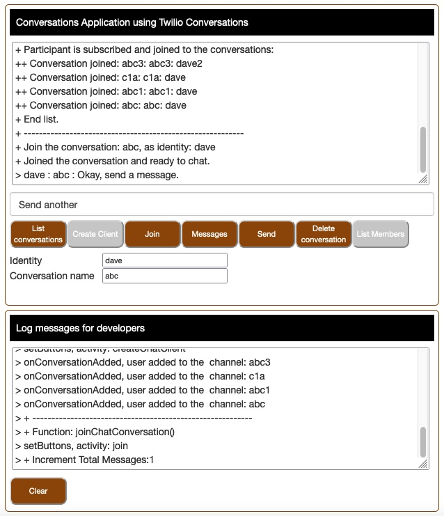

# Twilio Conversations Web Application

This Conversations web application is ready to run.
Set configurations using the Twilio Console,
add environment variables, 
and your ready to run it on your local server that has Node.js installed.

Client Application screen print:



Before running from command line, 
add the following as environment variables.
Create the variables where required.
+ CONVERSATIONS_ACCOUNT_SID : your Twilio account SID (starts with "AC", available from Twilio Console)
+ CONVERSATIONS_ACCOUNT_AUTH_TOKEN : Your Twilio account auth token
+ CONVERSATIONS_API_KEY : one of your Twilio API keys
+ CONVERSATIONS_API_KEY_SECRET : the matching API key secret string
+ CONVERSATIONS_SERVICE_SID : your Conversations service SID (starts with IS).
+ CONVERSATIONS_MESSAGING_SERVICE_SID : Conversation service Messaging Service SID.
+ PORT : optional, web server port. When running on a local server, default port is 8000.

### Requirements:

+ Twilio account. A free Trial account will work.
+ To run locally on your computer using the include web server, install Node.JS, the Twilio Node.JS helper library, 
    and Node express.

Install the Twilio SDK helper library. Install Node Express for running Node web servers.
````
$ npm install twilio
$ npm install express
````

## Files

- [docroot/index.html](docroot/index.html) : Client HTML
- [docroot/chat.js](docroot/chat.js) : Client JavaScript
- [docroot/custom/chat.css](docroot/custom/chat.css) : Chat client styles, CSS

- [webserver.js](webserver.js) : a NodeJS Express HTTP Server that serves the Chat client files.
- [chatcli.js](chatcli.js) : a standalone NodeJS command line chat program.

- [app.json](app.json) : Heroku deployment file to describe the application.
- [package.json](package.json) : Heroku deployment file which sets the programming language used.

## Twilio Console Configuration

These are the steps to configure to use the Chat Web Application.
No development or credit card information required to try Chat.

1. Create a Chat Service:

[https://www.twilio.com/console/chat/dashboard](https://www.twilio.com/console/chat/dashboard)

2. Create an API key and secret string:

[https://www.twilio.com/console/chat/runtime/api-keys](https://www.twilio.com/console/chat/runtime/api-keys)

--------------------------------------------------------------------------------
## For Developers

Following are the steps to run the Chat Web Application on your localhost computer.

Download this repository's zip into a working directory and unzip it.
Create an environment variable that is your Twilio Function Runtime Domain.
Example:
````
$ export ACCOUNT_SID ACxxx...xxx
$ export CHAT_SERVICE_SID ISxxx...xxx
$ export CHAT_API_KEY SKxxx...xxx
$ export CHAT_API_KEY_SECRET xxx...xxx
````
Run the Node.JS server program, install the required packages, then run the chat server or command line program.
````
$ npm install twilio
$ npm install twilio-chat
$ npm install express

$ node webserver.js
````
### Test the Chat Web Server
````
Use your browser to run the chat client:
http://localhost:8000
Enter a username, example: stacy.
Enter a Channel name and description, example: "mychannel" and "My test channel".

In another browser tab, run another chat client using a , same channel name:
http://localhost:8000
Enter a username, example: david (different username).
Enter a Channel name, example: mychannel (same as the other client).

Send messages between your clients.
````
--------------------------------------------------------------------------------
Cheers...
